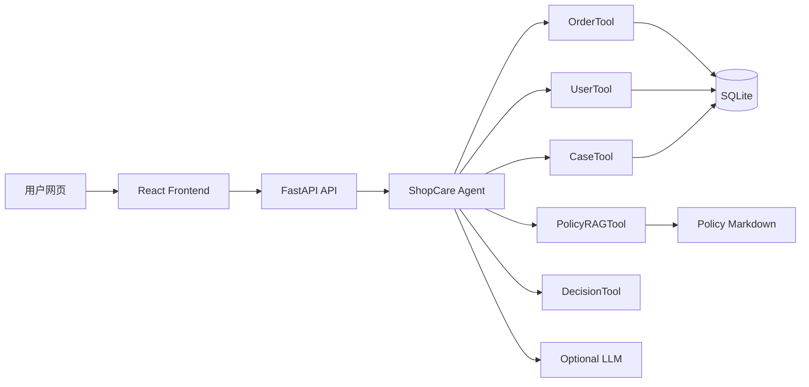

# ShopCare Agent 系统设计

## 目标

构建一个可部署、可演示、可写入实习简历的电商售后智能 Agent 网页系统。系统需要基于真实电商订单和用户数据回答售后问题，并输出可解释的处理方案。

## 参考来源

设计参考 `Hello-Agents` 中的以下思想：

- 第 4 章 ReAct：以“思考、行动、观察”的循环组织工具调用。
- 第 7 章 Agent 框架：LLM Client、Agent、Tool Registry、Tool Executor 分层。
- 第 8 章 RAG：从售后政策知识库检索依据。
- 第 9 章 Context Engineering：把角色、任务、订单状态、证据、输出格式结构化。
- 第 12 章 Agent 评估：保留工具调用轨迹，便于后续做决策准确率和工具调用评估。

## 数据

- `order.csv`：订单事实表。
- `user.csv`：用户画像表。
- `aftersales_cases.csv`：由订单和用户数据派生的售后案例表。
- `aftersales_policy.md`：人工整理的售后政策知识库。

## 架构

## Agent 流程

1. 从用户输入中抽取订单号和售后意图。
2. 查询订单，获得订单状态、商品类目、金额、履约时间、用户 ID。
3. 查询用户画像，获得用户等级、消费次数、历史金额。
4. 检索相似售后案例，获取历史处理方式。
5. 检索售后政策，获取规则依据。
6. 基于订单状态、商品类目、履约时间、金额、用户等级和政策生成决策。
7. 如配置 LLM，则用 DeepSeek/OpenAI 兼容接口润色最终回答；否则使用规则模板回答。
8. 返回工具调用轨迹、决策结果、证据和自然语言答复。

## MVP 范围

- 后端：数据导入、查询 API、Agent API、看板统计 API。
- 前端：售后对话页、订单画像、工具调用轨迹、决策结果、售后数据概览。
- 部署：提供本地运行、Render/Railway + Vercel 部署说明。

## 非目标

- 不直接接入淘宝、京东、拼多多真实平台 API。
- 不存储真实用户隐私密钥。
- 不在无人工确认时执行真实退款操作。
